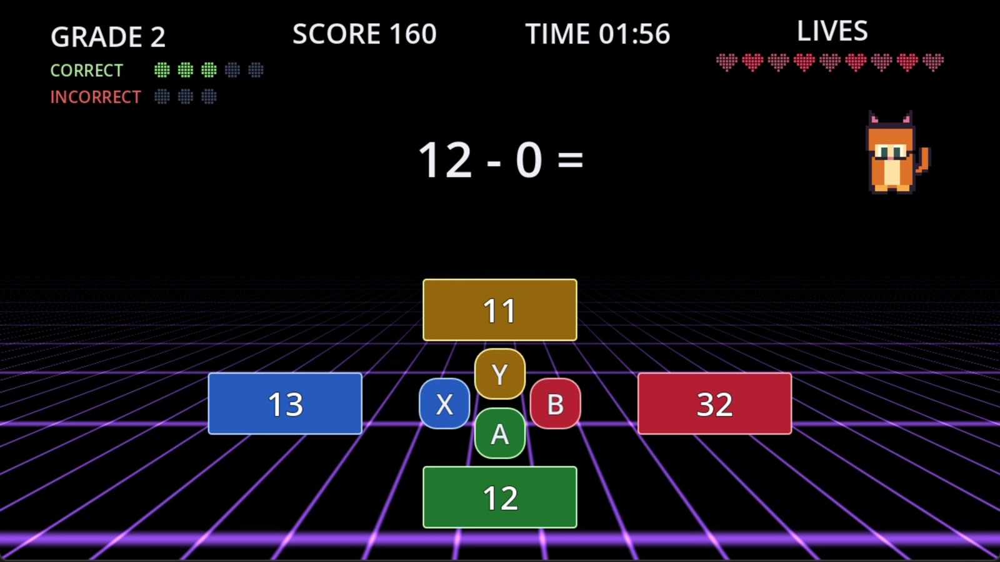

# Math Cat 🐱➕

<p align="center">
  <a href="Math-Cat-Trailer.mp4">
    
  </a>
</p>

<p align="center">
  <strong><a href="Math-Cat-Trailer.mp4">▶ Watch the official trailer</a></strong>
</p>

A retro 8-bit style educational math trivia game, built in **Godot 4.7** for the **xGames Game Jam - 2026 Microsoft Global Hackathon**.

Player controls a cat, answers 4-choice math questions, and climbs (or falls) through grade levels 1–12 based on performance. **Version 1 covers Grades 1–12, plus a bonus Grade 13 for college level material.**

- **Platform:** PC (Windows), keyboard + Xbox controller
- **Resolution:** 1280×720
- **Art style:** NES / Game Boy Color / Pokémon Red-Blue inspired pixel art
- **Engine:** Godot 4.7.1, GDScript

## Adventure Mode

Choose **ADVENTURE** from the title menu, then **Elementary**, **Middle**, or **High**. Each campaign has an original nine-stop city map with saved unlocks, completed markers, and a final boss.

- The world map and campaign picker use Rooftop Rescue's synthwave style: a midnight sky, striped sunset, pixel skyline, and a perspective grid. The map keeps rooftop buildings beneath stages 6-9, but not stages 1-5, and retains its nine-stop route, highlighted selection border, and campaign cat; **Animated Background** freezes the stars and grid without removing the city.
- Stage-button borders use bright cyan, blue, mint, lemon, gold, pink, and coral before the sun's warm peach at the boss, with consistent dark teal fills and white text. The middle stages avoid purple hues that blend into the scenery, and a dark outer edge separates each border from the skyline and grid. Thicker borders and a subtle glow highlight unlocked stages; selection strengthens both. Locked borders are dimmed, and `LOCK`, `NEXT`, and `DONE` still identify progress.
- Elementary covers Grades **1-4** as Kitten; Middle covers **5-8** as Big Cat; High covers **9-12** as Tiger. The campaign character stays fixed, including during bosses.
- Levels **1-8** require **10 correct answers**. Each grade has an untimed level followed by a timed level: **12**, **24**, or **36 seconds per question** for Elementary, Middle, or High. Wrong answers and timeouts cost one life without subtracting correct-answer progress.
- Every level entry or restart begins a **fresh nine-life attempt**. Pause freezes the timer; Restart retries that level; **World Map** leaves an incomplete attempt without completing it.
- Stages **1-8** each have their own **named-location pixel-art background**: gardens, a canal market, a tram quarter, a library, a harbor, a clockwork district, sky gardens, and a crystal avenue. Midnight skies, striped sunsets, city silhouettes, and perspective grids match the world map and Rooftop Rescue; each stage uses its map rectangle's neon accent. The sun rises a little higher with each stage, from low near the horizon in stage 1 to the world map's sun position in stage 8. The same eight locations appear across all campaigns. **Animated Background** freezes the scenery's motion without removing the artwork. Bosses remain unchanged: **Grade 12's background with Grade 13's music**, while keeping Kitten, Big Cat, or Tiger for their campaign.
- Bosses start with **2:00 on an overall session clock** and reuse Retro's **five-correct promotion / three-incorrect demotion** rules. Nonfinal promotions add **10 seconds per completed grade**, show green **Level Up!** feedback, and preserve the full cat celebration. Retro's promotion text is also green and uses **Level Up!** capitalization. Pause and grade-change feedback freeze the clock; reaching zero ends the attempt. Bosses start at Grade **1 / 5 / 9**, cannot demote below that grade, and win immediately on entering **5 / 9 / 13**.
- Every successful clear, **including replays**, awards the level's full coin reward through a short celebration. Normal levels return automatically to the map; bosses keep the final correct answer and campaign cat's evolution animation visible for **one second**, then open a green **VICTORY!** screen with **victory music played once**, staying open until **World Map** is selected. Retro also retains its one-second final-answer/evolution delay and green **VICTORY!** heading. Replays also improve saved results; duplicate completion events and save retries cannot pay the same attempt twice. Campaign progress, coins, and results share the existing profile; save errors remain visible and completion cannot return to the map until saved.
- Location names appear on the map, not during gameplay. Every boss HUD reads **FINAL BOSS**, at the same font size as **GRADE** and **LIVES**.
- Open **PET SHOP** on a campaign's world map to preview seven cosmetics: **Bow Tie (50 coins)**, **Bandana (100)**, **Golden Crown (200)**, **Top Hat (150)**, **Flower (75)**, **Sunglasses (125)**, and **Bell Collar (75)**. Wear one **head**, one **face**, and one **neck** item together; equipping replaces only the same slot. Purchases equip automatically. Switch or remove individual owned items for free, or choose **Remove All**. Coins, ownership, and equipment stay separate per campaign. Accessories appear on campaign selection, the map, gameplay, and results, and have no gameplay effects. Existing Settings colors remain free; other modes are unchanged.
- The shop's retro inventory uses navy-and-gold pixel frames, accessory icons, an explicit coin wallet, and a dressing-room preview with live **Head / Face / Neck** slots. All seven items stay visible; **Remove All** is separate in the footer alongside the primary action and World Map.
- Correct answers update lifetime grade totals and eligible achievements, without replacing Retro records or awarding Retro-only victories. Existing question selection, keyboard/controller controls, cat colors, music volumes, and pause options are reused.

See [docs/21_adventure_mode.md](docs/21_adventure_mode.md) for configuration, architecture, save fields, scene hierarchies, exact changed files, and verification details.

## Blitz Mode

Choose **BLITZ** from the title menu, select Grade **1-13**, and answer as many questions as possible in **two minutes (120 seconds)**. The clock starts when the first question is ready and keeps running in menus, including Options.

- Correct answers earn **+1** and highlight green; incorrect answers cost **-1**, including below zero, and highlight red with the correct answer revealed in grey. Feedback stays visible for **0.7 seconds** before the next question. The clock keeps running during feedback.
- The selected grade stays fixed. There are no lives, promotions, demotions, or time bonuses.
- Each grade has a **local top-10 leaderboard**. Positive scores from completed rounds qualify; earlier entries win ties. Restarting or quitting abandons the current run.
- Enter exactly **three A-Z initials** to save a qualifying score, or choose Skip. Keyboard: type letters, use Backspace to correct, and Enter to save. Controller: Left/Right selects a character slot, Up/Down changes its letter, and A advances to Save Score or confirms the selected action.
- Boards persist separately in Godot's `user://math_cat_blitz_scores.json`. Entering solo or two-player Blitz unlocks "Practice, we're talking about Practice": "Enter Blitz Mode, not a game, not a game." Blitz otherwise leaves career records and achievements unchanged. Save failures remain visible with Retry Save and Skip actions.

Keyboard gameplay uses arrow keys followed by Enter. Xbox gameplay uses the configured direct face-button or navigation controls, just like the other modes.

### Optional two-player Blitz

In Blitz setup, change **PLAYERS** from the default **1 PLAYER** to **2 PLAYERS**. Two-player controls default to **TWO CONTROLLERS**; **SHARED KEYBOARD** remains selectable. Both players race on the same question and grade for **two minutes (120 seconds)**, with separate scores and cats.

Both players share the familiar solo layout: one centered equation, one answer diamond, and one full-width perspective grid. Player 1's orange cat is on the left and Player 2's blue cat is on the right, each with its own score and feedback. The shared diamond always shows only Y/X/B/A, including in keyboard mode; keyboard bindings remain available in setup. Wrong choices highlight red, but the correct answer is revealed in grey only when both players are wrong. When both players answer incorrectly, both selected wrong choices stay red throughout the feedback hold, including the second guess; unselected incorrect choices have transparent backgrounds and outlines. When either player answers correctly, all incorrect choices become transparent. Answer text remains visible, and the next question restores every background and outline. Cat palettes remain distinct regardless of the solo Cat Color setting. Both cats use Retro's sprite animations and frame rates without extra smooth jump/shake tweens; the Animated Background option still applies.

- **Shared keyboard:** Player 1 uses **W/A/S/D**; Player 2 uses **arrow keys**. A direction immediately submits the answer at that position; no Enter is needed.
- **Two controllers:** choose **TWO CONTROLLERS**, then Start Blitz. Press A on one controller to join Player 1, A on a different controller to join Player 2, then Start Blitz. **Y / D-pad Up = up, X / D-pad Left = left, B / D-pad Right = right, A / D-pad Down = down.** Both input sets submit immediately without confirmation; the solo navigation preference does not change these controls.
- First correct answer gets **+1** and highlights green for Player 1 or blue for Player 2. A wrong answer gives **-1** and locks only that player out until the next question; the opponent can still answer. A correct answer or both players answering wrong starts a **0.7-second feedback delay**, then advances the shared question. Equal final scores are a draw.
- **Only the winner** can save a positive, qualifying score to a separate per-grade two-player top 10. Losers and draws never submit. High Scores has a Solo/Two Players selector; solo boards remain unchanged.
- Everything can be operated without a keyboard in controller mode, including menus, initials, Retry Save/Skip, and rematches. Either controller can manage shared menus/results. **Time continues** in menus and after a disconnect. A new controller can press A to claim a vacant slot while the recovery message is visible; connected players keep their slots.
- If all controllers disconnect, reconnect one to operate results, or reconnect/join two to play again. A rematch waits for both controllers before starting its clock. B/Escape returns to title while waiting. There is no mixed keyboard/controller mode or online play.

Two-player boards use `user://math_cat_blitz_duel_scores.json`, separate from solo scores and career records. First accepted correct input wins close races; queued input cannot answer a replacement question before it is displayed.

### Interactive two-player results preview

Run `tests\blitz_duel_results_preview.tscn` directly to test the real end-screen controls without waiting for a round. Its mouse-operated sidebar switches between winner initials, empty/draw, negative winner, nonqualifying full board, saved full board, and save failure. **Enable saving** repairs the simulated failure so Retry Save can be tested. Retry starts a real round; Title opens the normal title screen, and the preview sidebar remains available.

Use an isolated profile when launching this developer-only scene:

```powershell
$env:APPDATA = Join-Path $env:TEMP 'MathCat-Results-Preview'
New-Item -ItemType Directory -Path $env:APPDATA -Force | Out-Null
& 'C:\hackathon\MathCat\Godot_v4.7.2-stable_win64_console.exe' --path . 'tests\blitz_duel_results_preview.tscn'
```

The preview resets only its own `blitz-results-preview.json` fixture when selecting a screen. Add `-- --verify` to run its automated interaction checks and exit, or `-- --verify --capture` in a rendered run to also capture each results screen without the developer sidebar.

## Debug menu (debug builds only)

Press **~** or **backtick** from any screen to open the debug menu. Press it again, **Esc**, or **Close** to return. Use the mouse or Tab to edit fields. The overlay freezes gameplay, feedback animations, and all timers (including Blitz), then restores the previous pause state.

- **Records / Cosmetics & settings / Achievements / Adventure:** edit every saved profile field, grant or revoke achievements, choose cat colors, and set campaign completions, coins, and per-level results. Adventure completions stay sequential so unlocks survive reloads.
- **Solo scores / Duel scores:** add, edit, or remove leaderboard entries for any grade. The two stores remain separate; entries require three A-Z initials and positive scores.
- **Session:** change live scores, lives, timers, answer totals, streaks, grade progress, and both duel players' values. Start any mode at a chosen grade (or an unlocked Adventure level), complete/fail an attempt, or abandon it. Starting a two-player debug session uses shared keyboard controls.
- **Reset:** reset individual profile categories, either leaderboard, or all saved and live state.

Profile and leaderboard edits are drafts until **Apply** is confirmed. Resets and session-ending actions also require confirmation. These actions affect the actual local save files; failures remain visible and failed profile writes restore the previous in-memory data. Live values are not saved until normal gameplay records a result. Revoked achievements can be earned again, including lifetime achievements if their qualifying totals remain.

The menu and mutation APIs are disabled in release builds. Developer checks: run `tests\debug_menu_smoke_test.tscn` with isolated `APPDATA` and `--audio-driver Dummy`; add `-- --capture` in a rendered run for a menu screenshot.

## Plan Documents

| # | Doc | Contents |
|---|-----|----------|
| 1 | [docs/01_game_design_document.md](docs/01_game_design_document.md) | Core concept, loop, controls, scoring, screens |
| 2 | [docs/02_technical_architecture.md](docs/02_technical_architecture.md) | Godot project setup, autoloads, signals, state machine |
| 3 | [docs/03_scene_hierarchy.md](docs/03_scene_hierarchy.md) | Scene tree recommendations |
| 4 | [docs/04_data_model.md](docs/04_data_model.md) | Question data model, generators, save data |
| 5 | [docs/05_grade_progression_algorithm.md](docs/05_grade_progression_algorithm.md) | Promotion/demotion rules, pseudocode, flowchart |
| 6 | [docs/06_ui_wireframes.md](docs/06_ui_wireframes.md) | ASCII wireframes for every screen |
| 7 | [docs/07_pixel_art_asset_list.md](docs/07_pixel_art_asset_list.md) | Full sprite/art asset list with sizes |
| 8 | [docs/08_sound_effect_list.md](docs/08_sound_effect_list.md) | SFX + music list |
| 9 | [docs/09_dev_schedule_2day.md](docs/09_dev_schedule_2day.md) | Hour-by-hour 2-day jam schedule |
| 10 | [docs/10_backlog_moscow.md](docs/10_backlog_moscow.md) | MoSCoW-prioritized backlog |
| 11 | [docs/11_risks_mitigation.md](docs/11_risks_mitigation.md) | Risks + mitigation strategies |
| 12 | [docs/12_copilot_prompts.md](docs/12_copilot_prompts.md) | Ready-to-paste Copilot prompts per system |

## Key Design Decisions (read first)

These fill gaps not fully specified in the original brief — adjust if you disagree:

1. **Session/Game Over condition:** The game ends when **either** the 2-minute session timer (`SESSION_TIME_SEC = 120`) reaches zero **or** the player's 9-life pool (`START_LIVES = 9`) is exhausted, whichever comes first. Every incorrect answer removes one life. Final score, grade reached, and the triggering reason are shown on the Game Over screen and checked against the high score table.
2. **Demotion:** Simple flat model — 3 incorrect answers in the current grade always drops the player exactly **1 grade**. The incorrect-answer counter resets to 0 on promotion. Full detail in [doc 5](docs/05_grade_progression_algorithm.md).
3. **Scoring:** `points = 10 × current_grade` per correct answer, +50 bonus on promotion, to reward reaching/holding higher grades.
4. **Rendering approach:** Author pixel art on a small pixel grid, import with filtering **off**, and let sprites live directly in the 1280×720 scene (no low-res SubViewport). Simpler and safer for a 2-day jam; documented as an optional stretch polish item in doc 2.

Start with [docs/09_dev_schedule_2day.md](docs/09_dev_schedule_2day.md) and [docs/10_backlog_moscow.md](docs/10_backlog_moscow.md) once you're ready to build.
