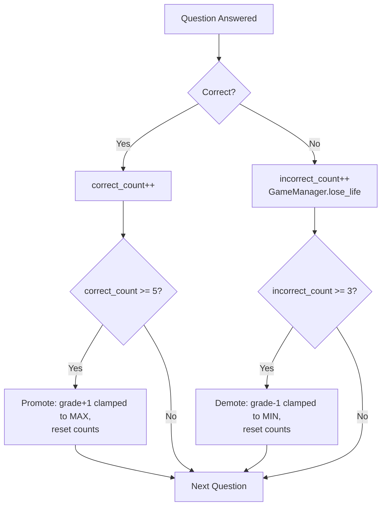

# 5. Grade Progression Algorithm

## State
```gdscript
var current_grade: int = 1
var correct_count: int = 0      # correct answers accumulated in this grade
var incorrect_count: int = 0    # incorrect answers accumulated in this grade

const PROMOTE_THRESHOLD := 5
const DEMOTE_THRESHOLD := 3
const MIN_GRADE := 1
const MAX_GRADE := 13   # Grades 6-13 use placeholder content; see doc 4/10
```

## Rules
- 5 correct answers accumulated in the current grade → promote 1 grade.
- 3 incorrect answers accumulated in the current grade → demote exactly **1 grade** (flat model, no escalation).
- The incorrect-answer counter resets to 0 whenever the player is promoted (as well as after any demotion), so a grade level always starts with a clean slate.
- Grade 1 is the floor — demotion can never drop the player below it.
- An actual promotion awards `10 × completed_grade` seconds immediately: Grade 1 → 2 gives 10 seconds, Grade 12 → 13 gives 120 seconds. Repeated promotions while already at Grade 13 do not award time because no new grade was reached.

## Level-Up Time Bonus
`GameManager` owns session time and listens to `ProgressionManager.promoted`. When `new_grade > old_grade`, it adds `TIME_BONUS_PER_COMPLETED_GRADE * old_grade` to `time_left`, emits `timer_tick` immediately so the HUD refreshes, then emits `time_bonus_awarded(completed_grade, bonus_seconds)` for presentation. The gameplay scene listens to that signal and briefly floats `+N Seconds!` beside the existing level-up/evolution celebration.

There is no audio subsystem in the current build, so the bonus signal is the integration point for a future level-up SFX call.

### Balance Recommendation
The uncapped $10 \times \text{completed grade}$ formula is a good early-game reward, but it grows to 120 seconds at Grade 12 — the size of a full starting session. For a jam build, keep the requested formula through Grade 5, then cap later rewards at 60 seconds: $\min(10 \times \text{completed grade}, 60)$. This preserves a meaningful recovery reward while preventing high-grade runs from becoming timer-free. The current implementation intentionally remains uncapped to match the stated rules.

## Pseudocode
```gdscript
func register_answer(is_correct: bool) -> void:
    if is_correct:
        correct_count += 1
        if correct_count >= PROMOTE_THRESHOLD:
            _promote()
    else:
        incorrect_count += 1
        if incorrect_count >= DEMOTE_THRESHOLD:
            _demote()

func _promote() -> void:
    var old_grade := current_grade
    current_grade = min(current_grade + 1, MAX_GRADE)
    correct_count = 0
    incorrect_count = 0              # demotion counter reset upon promotion
    promoted.emit(old_grade, current_grade)

func _demote() -> void:
    var old_grade := current_grade
    current_grade = max(current_grade - 1, MIN_GRADE)
    correct_count = 0
    incorrect_count = 0
    demoted.emit(old_grade, current_grade)
```

### Edge Cases
- **Already at MIN_GRADE (1) and demoted again:** `current_grade` stays 1 (`max(1-1,1)`). Still emit `demoted` with `old_grade == new_grade == 1` so the UI can show a "no lower to go!" variant or just a shake, without implying an actual grade change.
- **Already at MAX_GRADE (13 in the current build) and promoted again:** `current_grade` clamps at `MAX_GRADE`; still emit `promoted` so the player gets fanfare/points, even though the number doesn't change (or optionally show a "Mastered Grade 13!" variant on repeat promotions — Could-have).
- **Counters accumulate independently:** a correct answer does not erase prior incorrect answers, and an incorrect answer does not erase prior correct answers. Both counters reset only when the player changes grade through promotion or demotion.

## Interaction with the Life System (see doc 2 / doc 12 GameManager)
Every incorrect answer does **two independent things**:
1. Increments `ProgressionManager.incorrect_count` toward the 3-strike demotion above (grade-scoped, resets on promotion/demotion).
2. Decrements `GameManager.lives` toward the session-ending 9-life pool (session-scoped, resets only at the start of a new session/run).

These counters are intentionally decoupled — a player can be demoted multiple times across a single 9-life run, and the life pool is unaffected by grade changes.

## Flow Diagram


## Testing Tip
Because `ProgressionManager` has zero UI dependencies, write a throwaway `res://tools/progression_test.gd` script attachable to a temp scene that feeds `register_answer(true/false)` sequences and `print()`s `current_grade` to verify: 5-correct promotes by 1, 3-incorrect demotes by 1, and grade never drops below 1.
